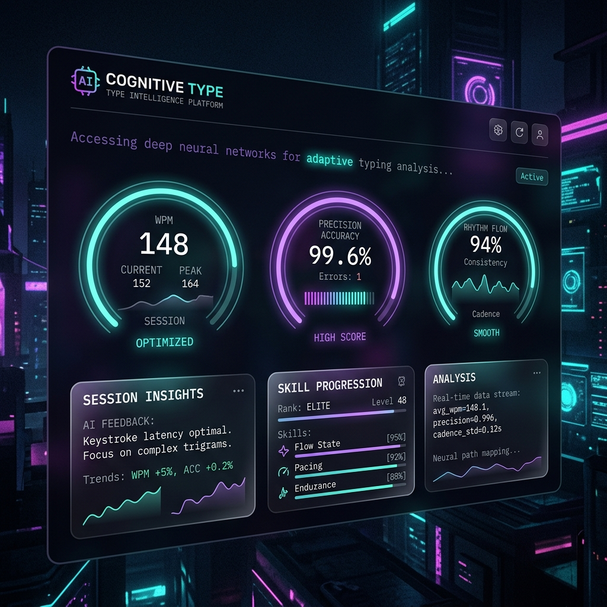
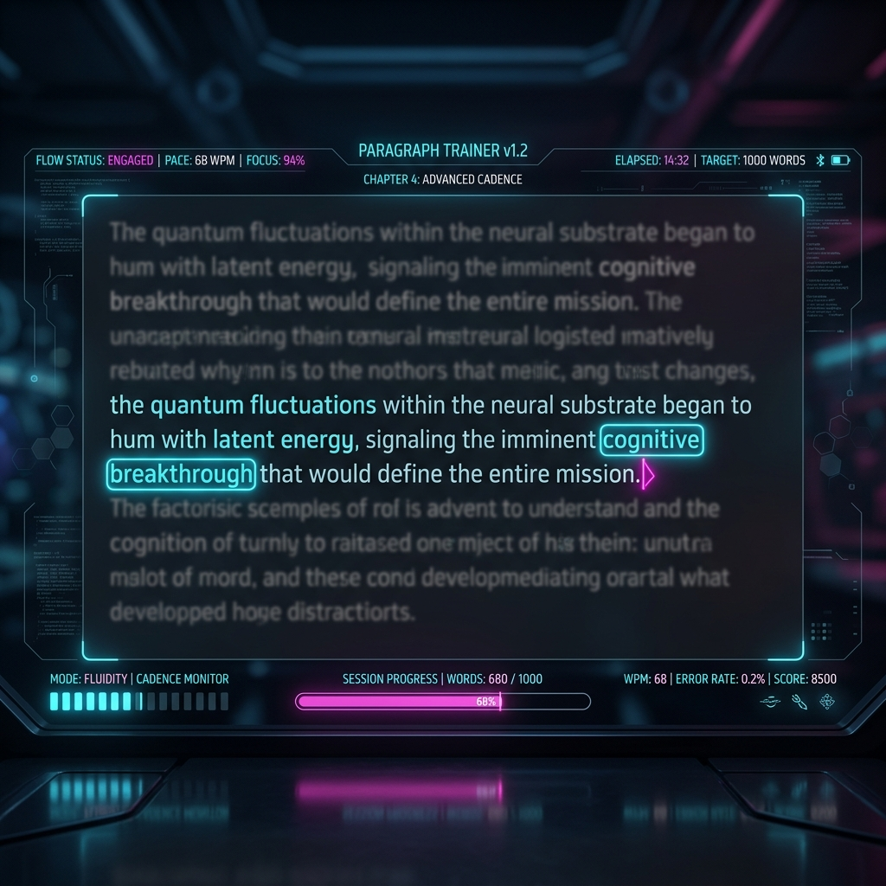
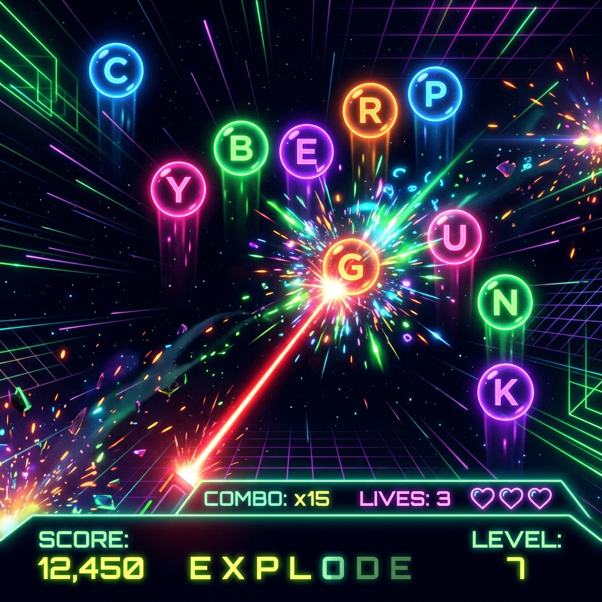
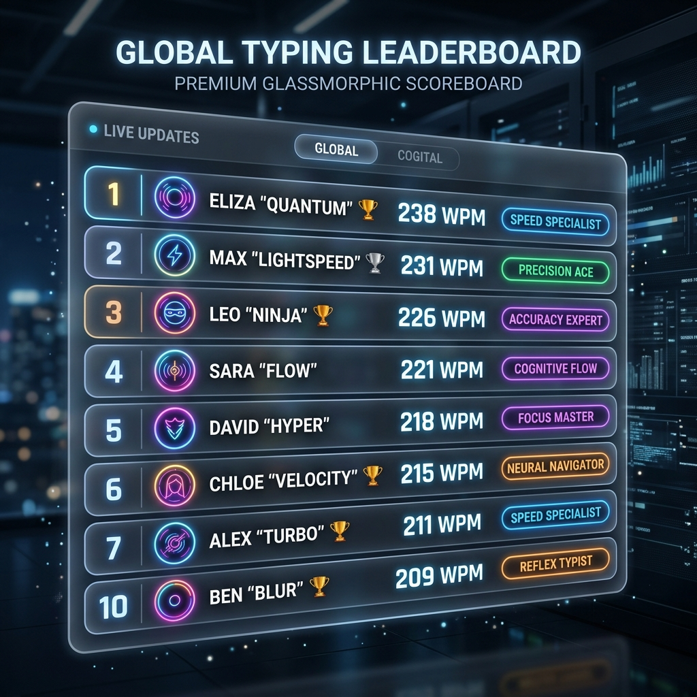

# 🧠 AI-Powered Typing Intelligence & Cognitive Training Platform

> An advanced, highly immersive web platform designed to analyze typing rhythm, train spatial keyboard memory, assess visual reaction times, and decode cognitive writing performance using real-time telemetry.

---

## 🎨 Visual Previews

### 📊 Performance Dashboard


### 🎓 Blind Typing Academy


### 🎬 Paragraph Flow Trainer


### 🫧 Bubble Pop Gameplay


### 🏆 Interactive Leaderboard


---

## ⚡ Core Features

### 1. 🎓 Blind Typing Academy
A comprehensive spatial touch-typing course structured into a progressive **9-stage training architecture** to systematically transition users from looking down to pure finger memory autonomy:
- **Stage 1 (Home Row)**: Anchoring resting finger placements (`ASDF JKL;`).
- **Stage 2 (Top Row)**: Vertical reaching and snapping extensions.
- **Stage 3 (Bottom Row)**: Natural downward finger curls.
- **Stage 4 (Number Row)**: Extended vertical spatial awareness.
- **Stage 5 (Symbols)**: Modifiers, brackets, and symbol placement.
- **Stage 6 (Capitalizations)**: Coordination of cross-hand Shift keys.
- **Stage 7 (Word Flow)**: Common Vocabulary bigrams & trigrams.
- **Stage 8 (Sentence Flow)**: Sentence transitions and basic punctuation.
- **Stage 9 (Full Paragraphs)**: Cognitive reading-to-keystroke control.

### 2. 🎬 Cinematic Writing Studio
Contains dedicated workspaces for long-form typing and creative compositions:
- **Paragraph Flow Trainer**: Immersive "writing cockpit" featuring particle backdrops, smooth carets, categories (e.g. Coding Syntax, AI Articles, Storytelling, Business Memo), and a **line-focus effect** that dims adjacent text to maximize user concentration.
- **Real-World Sandbox**: A free-writing environment with optional prompts (e.g. professional emails, sci-fi writing, code drafts) and a timer that conducts rhythm calculations on final compositions.

### 3. 🕹️ Cognitive Games Suite
Three high-fidelity gaming systems that evaluate and train specific typing capabilities:
- **Bubble Pop**: An arcade canvas-rendered game evaluating reaction time, tracking accuracy, and focus under speed pressure.
- **Word Racer**: A time-attack game testing word-chunking cognitive flow and burst typing.
- **Rhythm Strike**: A metronome-style drill checking timing synchronization and keystroke cadence.

### 4. 🧠 Unified Telemetry & AI Coach
Calculates multi-dimensional stats across all games and lessons to form a unified profile:
- **Rhythm Deviation**: keystone interval standard deviation.
- **Flow Consistency**: median rolling interval alignment.
- **Live Keyboard Heatmaps**: 3 interactive maps tracking errors, speed, and keys confidence.
- **AI Coach Insights**: Actionable, rules-based cognitive remarks detecting hand speed imbalance (e.g. left vs right hand speed ratios) and keys drift.

---

## 🛠️ Technology Stack

- **Core**: React 18, Javascript (ES6+)
- **Build System**: Vite (optimized production bundling via React lazy loading)
- **Styling**: Modern CSS (glassmorphic styling, custom CSS variables, custom keyframe transitions)
- **Telemetry Engine**: Custom analytics checking timestamps, intervals, and deviations
- **Audio Synthesizer**: Web Audio API oscillator context (zero weight, zero network overhead)
- **Icons**: Lucide React

---

## 📈 Future Expansion Roadmap

- [ ] **Multiplayer Arena**: Sprints with real-time WPM race tracking via WebSockets.
- [ ] **AI Adaptive Layouts**: Real-time layout adjustments highlighting paths for user's weakest keys.
- [ ] **Cloud Persistence API**: Score submission validation with encrypted telemetry.
- [ ] **3D Interactive Heatmap**: WebGL/Three.js keyboard visualization model showing temperature colors.
- [ ] **Deep Learning Models**: Predict typing fatigue and cognitive overload using linear regressions.

---

## 🚀 Installation & Local Launch

### Prerequisites
- Node.js (v18 or higher)
- npm (v9 or higher)

### Setup Steps
1. Clone the repository:
   ```bash
   git clone https://github.com/RajYagnik504/Typing-Trainer.git
   cd Typing-Trainer
   ```
2. Install dependencies:
   ```bash
   npm install
   ```
3. Run the development server:
   ```bash
   npm run dev
   ```
   Open `http://localhost:5173/` in your browser.

4. Build production bundle:
   ```bash
   npm run build
   ```

---

## 🌐 Deployment Instructions

### Vercel / Netlify
1. Connect your GitHub repository to your Vercel or Netlify account.
2. Configure build settings:
   - **Build Command**: `npm run build`
   - **Publish Directory**: `dist`
3. Click deploy! The routing is handled client-side and optimized via code splitting.

---

## 📄 License

This project is licensed under the [MIT License](LICENSE).
